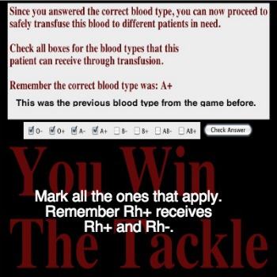
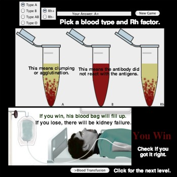

# Blood-Typing-Game
The Blood Typing Game is a Java game for understanding blood types and transfusion.

By: Aashia Mehta

## Functionalities
- [x] User can determine the blood type of a patient using anti-serums for each type of antigen. If Anti-Serum A is added to a sample of blood and the user sees clumps, this indicates a positive result and the blood contains A antigens. If the blood is normal, this indicates a negative result and the blood does not have A antigens. This process continues by testing B and D anti-serums to determine the full blood type.
- [x] User can determine what blood types can be safely transfused by checking the blood type. Next, the user can check the Rh factor. If the allele for the Rh gene is positive (+), then the user can transfuse positive (+) and negative (-) blood. If the allele for the Rh gene is negative (-), then you can only transfuse negative (-) blood.

## Images

## Notes
This was one of the first coding projects I created on my own for my Java class in high school. This class peaked my interest in computer science and was the reason I decided to pursue it as my major in college.
